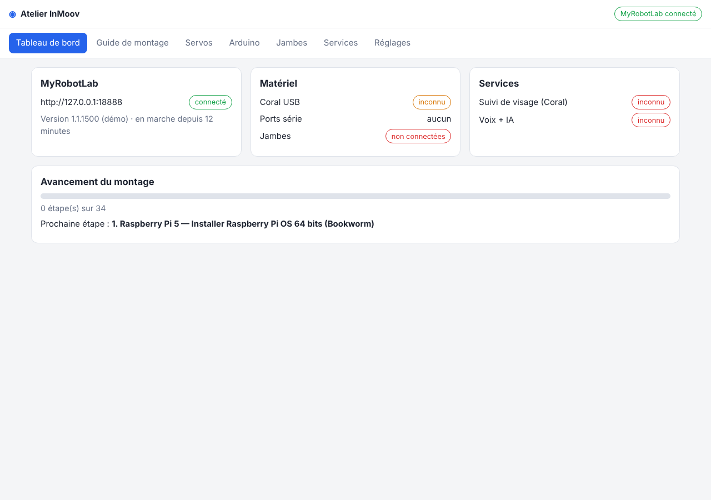
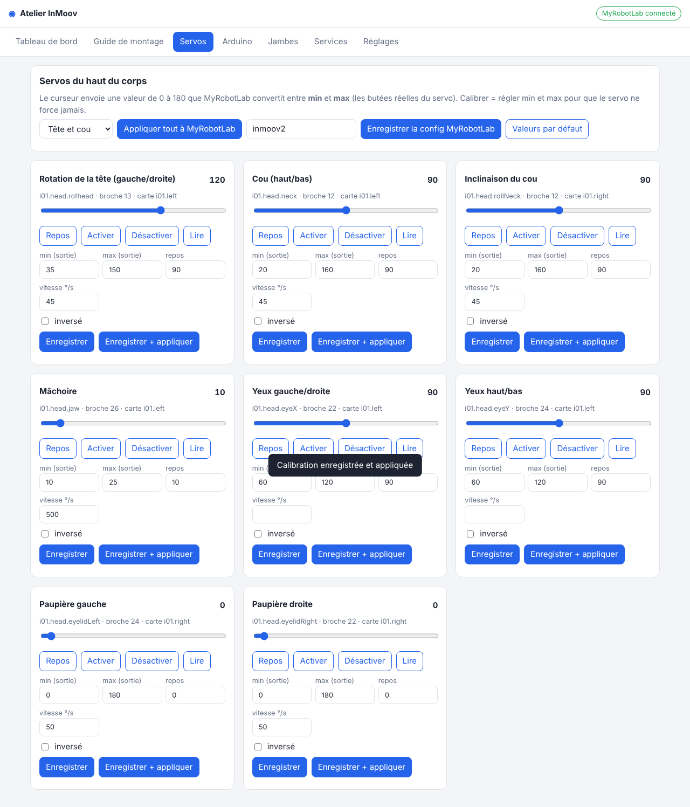

# InMoov : Raspberry Pi 5 + Coral USB

Deux programmes qui tournent **à côté de MyRobotLab (Nixie)** sur le Raspberry Pi 5
et lui parlent par son API REST (`http://127.0.0.1:8888/api/service/...`) :

| Programme | Rôle | Python |
|---|---|---|
| `vision/face_tracker.py` | Caméra USB → Coral USB → tourne `rothead` / `neck` vers le visage le plus proche | **3.9** (obligatoire pour PyCoral) |
| `voice/speech_listener.py` | Micro → détection de voix → Whisper → commandes locales, **IA Claude** ou chatbot `i01.chatBot` | 3.11 (celui du système) |
| `voice/llm_brain.py` | IA conversationnelle (Claude) qui remplace le chatbot AIML et peut bouger la tête et les mains | 3.11 |
| `legs/` | Jambes motorisées : firmware Arduino Mega, pilotage depuis le Pi, calcul des moteurs | Arduino + 3.11 |
| `app/` | **Atelier InMoov** : application web pour tout monter, programmer et régler (voir section 0) | 3.11 |

```
 Caméra USB ─► face_tracker.py (Coral) ──┐  POST /api/service/i01.head.rothead/moveTo [95.0]
                                         ├─► MyRobotLab Nixie (InMoov2) ─► Arduino Mega ─► servos
 Micro USB ──► speech_listener.py ───────┘  POST /api/service/i01.chatBot/getResponse ["bonjour"]
                                                         └─► htmlFilter ─► i01.mouth (synthèse vocale)
```

## 0. Atelier InMoov : l'application qui regroupe tout

Une application web qui tourne sur le Raspberry Pi et s'ouvre depuis un téléphone, une
tablette ou un PC du même réseau : `http://<adresse-du-pi>:8090`.



| Onglet | Ce qu'il fait |
|---|---|
| **Tableau de bord** | État de MyRobotLab, du Coral, des ports série, des services, avancement du montage |
| **Documentation** | **Le manuel complet** : un chapitre par partie du corps (tête et cou, torse et électronique, bras, mains, bassin, jambes, capteurs) avec rôle, servos, schéma de câblage, pièces, montage pas à pas, réglages, test final, problèmes fréquents et liens officiels ; plus logiciel, IA, dépannage général et tous les liens. Recherche intégrée et bouton « Tout imprimer / PDF ». Version PDF prête : [docs/manuel-inmoov.pdf](docs/manuel-inmoov.pdf) |
| **Guide de montage** | 43 étapes en 10 phases (Pi, MyRobotLab, électronique, tête et cou, bras/mains/torse, vision, voix et IA, jambes, mise en service, nouveautés IA et capteurs), à cocher, avec les commandes à copier |
| **Schémas** | Un schéma de câblage par partie (tête, torse, bras, mains, bassin, jambes) généré automatiquement, la liste des servos (modèle, carte, canal), les **pièces imprimées à cocher**, le matériel, et l'**électronique simplifiée** : une seule Arduino Mega + 3 cartes PCA9685, avec le script MyRobotLab qui rattache chaque servo à sa carte |
| **Schémas électriques** (dans l'onglet Schémas) | **8 schémas détaillés** : alimentation générale, tête, cou, torse, bras, mains, bassin, jambes. Chaque fil, chaque broche, chaque fusible, avec la **liste de câblage** (de → à, type, couleur, section) et les points de vigilance. PDF prêt : [docs/schemas-electriques.pdf](docs/schemas-electriques.pdf). **Projet KiCad** : dossier [kicad/](kicad/LISEZMOI.md) ou bouton « Projet KiCad (.zip) » |
| **Circuit imprimé** | [Shield jambes](pcb/shield_jambes/LISEZMOI.md) pour l'Arduino Mega n°2 : prêt à commander (`shield_jambes-gerber.zip`), avec la liste des composants et le mode d'emploi de soudure |
| **Capteurs** | Courant et tension de chaque carte (coupure automatique si un servo force), batterie, toucher au bout des doigts, présence, bouton « prise douce » |
| **IA** | État de l'IA (Claude, vision, IA locale, voix Piper, LED), **souvenirs** du robot (à consulter ou effacer), **gestes appris** à rejouer |
| **Servos** | Les 31 servos d'InMoov2 (tête et cou, torse, bras, mains) : curseur pour bouger, repos, activer/désactiver, lire la position, **calibration** (min, max, repos, vitesse, sens), envoi à MyRobotLab et enregistrement de sa configuration |
| **Arduino** | Voir le code, **compiler et téléverser** MrlComm (les deux Mega du haut du corps) et le firmware des jambes, installer le cœur AVR et les bibliothèques, détecter les cartes branchées |
| **Jambes** | Connexion à l'Arduino des jambes, état de chaque servo (position, charge, température, tension), RESET, FIGER, couple, poses et séquences (mouvement seulement si « robot sur portique » est coché), **pieds et équilibre** : poids et centre de pression de chaque pied, tare, équilibre surveillé ou actif |
| **Services** | Démarrer, arrêter et voir le journal du suivi de visage et de la voix |
| **Réglages** | Adresse et dossier de MyRobotLab, arduino-cli, édition **vérifiée** de `config.json` et de la config des jambes (copie `.bak` à chaque enregistrement) |



### Électronique simplifiée (onglet Schémas)

Au lieu de brancher chaque servo sur deux Arduino Mega, on utilise **une seule Mega** (i01.left,
programme MrlComm) et **3 cartes PCA9685** de 16 voies reliées par un bus I2C à 4 fils
(service MyRobotLab `Adafruit16CServoDriver`) :

| Carte | Adresse | Pont à souder | Servos |
|---|---|---|---|
| A | 0x40 | aucun | tête (8) + ventre (3) |
| B | 0x41 | A0 | bras gauche (4) + main gauche (6) |
| C | 0x42 | A1 | bras droit (4) + main droite (6) |

Le bouton **« Appliquer à MyRobotLab »** (ou le script à coller dans l'onglet Python de MyRobotLab)
crée les 3 cartes, les attache à `i01.left` en I2C (`attach("i01.left", "0", "0x40")`, comme dans
l'exemple officiel de MyRobotLab) puis fait pour chaque servo `detach()`, `setPin(canal)`, `attach(carte)`.
Enregistrez ensuite la config MyRobotLab (onglet Servos).

Pourquoi passer par l'Arduino et pas directement par le Raspberry Pi 5 ? Le service RasPi de
MyRobotLab repose sur Pi4J 1.x / wiringPi, qui ne gère pas le Pi 5.

Alimentation : 6 V forte puissance → bornier avec un fusible par carte ; pour les gros servos,
+ et − pris directement sur le bornier et seulement le signal sur la carte ; masses toutes reliées.

### Installation

```bash
cd /home/pi/inmoov
python3 -m venv .venv-app
.venv-app/bin/pip install -r app/requirements.txt
sudo usermod -aG dialout pi            # accès aux ports série (Arduino), puis se reconnecter

# arduino-cli (compilation et téléversement depuis l'appli)
curl -fsSL https://raw.githubusercontent.com/arduino/arduino-cli/master/install.sh | BINDIR=$HOME/.local/bin sh

# mot de passe de l'appli (conseillé : elle peut bouger le robot et reprogrammer les cartes)
echo 'INMOOV_APP_PASSWORD=choisissez-un-mot-de-passe' > app.env && chmod 600 app.env

cd app && set -a && . ../app.env && set +a && ../.venv-app/bin/python app.py
```

Pour que les boutons Démarrer / Arrêter de l'onglet Services fonctionnent, autorisez **uniquement**
ces commandes sans mot de passe (`sudo visudo -f /etc/sudoers.d/inmoov`) :

```
pi ALL=(root) NOPASSWD: /usr/bin/systemctl start inmoov-vision, /usr/bin/systemctl stop inmoov-vision, /usr/bin/systemctl restart inmoov-vision, /usr/bin/systemctl start inmoov-voice, /usr/bin/systemctl stop inmoov-voice, /usr/bin/systemctl restart inmoov-voice, /usr/bin/systemctl start inmoov-sensors, /usr/bin/systemctl stop inmoov-sensors, /usr/bin/systemctl restart inmoov-sensors
```

Démarrage automatique : service `systemd/inmoov-app.service` (voir section 5).

### Bon à savoir

- Le curseur d'un servo envoie une valeur **de 0 à 180** que MyRobotLab convertit entre **min** et
  **max** (c'est le fonctionnement d'InMoov2). Les valeurs par défaut affichées viennent du code
  de MyRobotLab (InMoov2HeadConfig, InMoov2ArmConfig, InMoov2HandConfig, InMoov2TorsoConfig).
- « Enregistrer + appliquer » envoie `setMinMaxOutput`, `setInverted`, `setRest` et `setSpeed` au servo ;
  « Enregistrer la config MyRobotLab » appelle `runtime.saveConfig` pour que ce soit conservé au redémarrage.
- MrlComm est pris dans le dossier de MyRobotLab (`<mrl_dir>/resource/Arduino/MrlComm`) pour être
  toujours de la même version que MyRobotLab. **Arrêtez MyRobotLab** (ou déconnectez la carte) avant
  de téléverser : le port série ne peut pas servir à deux programmes.
- Testée avec un faux MyRobotLab et un faux Arduino des jambes : le firmware des jambes a été
  **réellement compilé depuis l'appli**. Elle n'a pas encore été essayée avec le vrai robot.

## 1. Préparer le Raspberry Pi 5

- Raspberry Pi OS **64 bits** (Bookworm), alimentation officielle **5 V / 5 A**
  (sinon les ports USB sont limités à 600 mA, insuffisant pour Coral + caméra + micro).
- Brancher le **Coral USB sur un port USB 3 (bleu)**.
- MyRobotLab Nixie installé et InMoov2 démarré (WebGui sur le port 8888).
- **Désactiver le suivi de visage intégré d'InMoov2** pour ne pas avoir deux programmes qui
  bougent la tête en même temps.

Copier ce dossier sur le Pi, par exemple dans `/home/pi/inmoov`, puis :

```bash
cd /home/pi/inmoov
cp config.example.json config.json   # puis l'adapter à votre robot
```

## 2. Vision : Coral USB + suivi de visage

### Pilote Edge TPU

```bash
sudo mkdir -p /etc/apt/keyrings
curl -fsSL https://packages.cloud.google.com/apt/doc/apt-key.gpg | sudo gpg --dearmor -o /etc/apt/keyrings/coral.gpg
echo "deb [signed-by=/etc/apt/keyrings/coral.gpg] https://packages.cloud.google.com/apt coral-edgetpu-stable main" \
  | sudo tee /etc/apt/sources.list.d/coral-edgetpu.list
sudo apt update
sudo apt install libedgetpu1-std     # libedgetpu1-max = plus rapide mais chauffe beaucoup
```

Débrancher puis rebrancher le Coral. `lsusb` doit afficher `1a6e:089a Global Unichip`
(ou `18d1:9302 Google` une fois initialisé).

### Python 3.9 avec pyenv

```bash
sudo apt install -y build-essential libssl-dev zlib1g-dev libbz2-dev libreadline-dev \
  libsqlite3-dev libffi-dev liblzma-dev tk-dev
curl https://pyenv.run | bash
# suivre les instructions affichées pour ajouter pyenv au ~/.bashrc, puis :
pyenv install 3.9.19
~/.pyenv/versions/3.9.19/bin/python -m venv .venv-vision
.venv-vision/bin/pip install -r vision/requirements.txt
```

> Si `pip` ne trouve pas de paquet `pycoral` pour votre système, l'autre solution
> fiable est de lancer `face_tracker.py` dans un conteneur Docker Debian 10 (Python 3.7),
> comme expliqué par Jeff Geerling.

### Modèle de détection de visage

```bash
mkdir -p models
wget -P models https://raw.githubusercontent.com/google-coral/test_data/master/ssd_mobilenet_v2_face_quant_postprocess_edgetpu.tflite
```

### Lancer

```bash
cd vision
../.venv-vision/bin/python face_tracker.py --config ../config.json --dry-run -v   # test sans bouger la tête
../.venv-vision/bin/python face_tracker.py --config ../config.json
```

### Réglages (`config.json` → `vision`)

| Clé | Effet |
|---|---|
| `pan.invert` / `tilt.invert` | La tête part dans le mauvais sens ? Passez à `true` / `false`. |
| `gain` | Vitesse de réaction. Trop grand = la tête oscille ; trop petit = elle traîne. |
| `deadband` | Zone morte au centre de l'image (0.08 = 8 %), pour éviter les tremblements. |
| `max_step` | Nombre maximum de degrés par commande (protège les servos). |
| `min` / `max` | **Mettez les mêmes limites que dans MyRobotLab** pour ne jamais forcer la mécanique. |
| `show_window` | `true` pour voir l'image et les visages détectés (écran nécessaire). |

## 3. Reconnaissance vocale améliorée

Améliorations par rapport à la reconnaissance d'origine :

1. **Whisper (faster-whisper) hors ligne** : bien meilleur en français, pas besoin d'Internet.
2. **Détection de voix (WebRTC VAD)** : Whisper n'est appelé que quand quelqu'un parle,
   ce qui économise le processeur et évite les phrases inventées sur le bruit des servos.
3. **Filtres anti-erreurs** : on ignore les segments à faible confiance et les « hallucinations »
   connues de Whisper en français (« Sous-titres réalisés par la communauté d'Amara.org »...).
4. **Mot de réveil tolérant** : « InMoov », « In Moov », « Inmove » sont tous acceptés.
   Dire juste « InMoov » → le robot répond « oui ? » et écoute la phrase suivante.
5. **Vocabulaire** (`vocabulary`) : les mots donnés aident Whisper à bien écrire les noms propres.
6. **Commandes locales** instantanées (`commands`), avec tolérance aux petites erreurs ;
   tout le reste part au chatbot d'InMoov2.
7. **Le micro est ignoré pendant que le robot parle** (durée estimée d'après la longueur de la réponse).

### Installation

```bash
sudo apt install -y libportaudio2
python3 -m venv .venv-voice
.venv-voice/bin/pip install -r voice/requirements.txt
cd voice
../.venv-voice/bin/python speech_listener.py --list-devices      # trouver le numéro du micro
../.venv-voice/bin/python speech_listener.py --config ../config.json --dry-run
```

Au premier lancement, le modèle Whisper est téléchargé (environ 150 Mo pour `base`).

### Choix du modèle Whisper (`whisper_model`)

| Modèle | Français | Vitesse sur Pi 5 |
|---|---|---|
| `tiny` | moyen | le plus rapide (≈ 2-3 s pour 10 s d'audio) |
| `base` | **bon compromis (par défaut)** | rapide |
| `small` | très bon | plus lent, à tester selon votre patience |

Les phrases adressées au robot sont courtes (2 à 4 s), donc le temps de réponse
est bien plus court que pour 10 s d'audio.

### Le matériel compte autant que le logiciel

- Un **micro USB de conférence** ou un **ReSpeaker USB Mic Array** (avec réduction de bruit)
  donne de bien meilleurs résultats qu'une webcam ou un micro jack.
- Placez le micro **loin des servos et du ventilateur** du Pi, idéalement dans la tête, orienté vers l'avant.
- Trop de fausses détections ? Montez `vad_aggressiveness` à 3.
  Le robot ne vous entend pas ? Descendez-le à 1.

## 4. IA conversationnelle (Claude) à la place du chatbot d'InMoov2

Quand `brain.enabled` vaut `true` dans `config.json`, les phrases qui ne sont pas des
commandes locales partent vers **Claude** (API Anthropic) au lieu du chatbot AIML :

- réponses naturelles en français, courtes et adaptées à la synthèse vocale ;
- **mémoire de la conversation** (remise à zéro après 10 min de silence, `reset_after_idle_s`) ;
- Claude peut **tourner la tête, ouvrir/fermer les mains, revenir au repos** (outils `move_head`,
  `hand`, `rest_position`), toujours dans les limites de `config.json` ;
- **les jambes ne sont pas accessibles à l'IA**, volontairement ;
- si Internet ou l'API ne répond pas, le robot **repasse automatiquement sur le chatbot d'InMoov2** ;
- si Claude refuse une demande, l'API la relance sur le modèle de secours recommandé
  (option `fallbacks: "default"`), sinon le robot dit poliment qu'il ne répond pas.

### Mise en route

1. Créer une clé API sur <https://platform.claude.com> (l'usage est payant, au nombre de mots traités).
2. Sur le Pi :
   ```bash
   echo 'ANTHROPIC_API_KEY=sk-ant-...' > /home/pi/inmoov/anthropic.env
   chmod 600 /home/pi/inmoov/anthropic.env      # ce fichier ne doit jamais aller sur GitHub
   ```
3. Dans `config.json` → `brain` : mettre votre prénom dans `owner_name`, le nom du robot dans
   `robot_name`, et éventuellement des consignes dans `extra_instructions`
   (« Tu tutoies tout le monde », « Tu adores l'astronomie »...).
4. Test sans bouger le robot : `../.venv-voice/bin/python speech_listener.py --config ../config.json --dry-run`
   (avec la clé chargée : `set -a; . ../anthropic.env; set +a`).

| Clé `brain` | Effet |
|---|---|
| `model` | `claude-opus-5-5` par défaut |
| `effort` | `low` = réponses plus rapides et moins chères (bien pour la conversation) ; `medium`/`high` = plus réfléchi mais plus lent |
| `max_tool_rounds` | nombre maximum de gestes enchaînés pour une même phrase |
| `*_service`, `*_min`, `*_max` | noms des services MyRobotLab et limites des mouvements autorisés à l'IA |

## 5. Démarrage automatique

```bash
sudo cp systemd/inmoov-*.service /etc/systemd/system/
sudo systemctl daemon-reload
sudo systemctl enable --now inmoov-app inmoov-vision inmoov-voice inmoov-sensors
journalctl -u inmoov-voice -f      # voir ce que le robot entend
```

## 6. Tests (sans matériel)

```bash
python3 -m unittest discover -s tests -v
```

Ces tests vérifient l'Atelier (avec un faux MyRobotLab, si Flask est installé), la logique de suivi, le découpage audio, le mot de réveil, les commandes,
le format des appels à MyRobotLab (avec un faux serveur), le cerveau Claude (avec un faux client,
si le paquet `anthropic` est installé), les poses des jambes, la cohérence des limites
entre le Pi et le firmware Arduino, et le calcul de couple.
Ils **ne remplacent pas** un essai réel avec le Coral, la caméra et le micro.

## 7. Jambes motorisées

> ⚠️ **Sécurité d'abord.** Un robot de cette taille qui tombe se casse et peut blesser.
> Tous les essais se font **robot accroché à un portique** (sangle au niveau du bassin),
> avec un **arrêt d'urgence matériel qui coupe l'alimentation des servos**.
> Le firmware ajoute des protections, il ne remplace pas ces deux-là.

Les jambes publiées par Gaël Langevin sont prévues pour tenir debout ; il n'existe pas de
version motorisée officielle. Ce dossier fournit une base pour **12 articulations**
(6 par jambe : hanche lacet / roulis / tangage, genou, cheville tangage / roulis).

### 7.1 Choisir les moteurs : d'abord peser le robot

```bash
cd legs
python3 torque_calc.py --masse 18                 # remplacez 18 par la masse réelle portée par les jambes
python3 torque_calc.py --masse 18 --reduction 4   # avec une réduction 4:1 (poulies/engrenages)
```

Exemple **pour 18 kg** (valeur d'exemple, pas la masse de votre robot), coefficient de sécurité 1,5 :

| Articulation | Couple sans réduction | Avec réduction 4:1 |
|---|---|---|
| Genou (accroupi 40°, 2 pieds) | 176 kg·cm | 44 kg·cm |
| Hanche roulis / cheville roulis (sur 1 pied) | 243 kg·cm | 61 kg·cm |
| Cheville tangage (sur 1 pied) | 135 kg·cm | 34 kg·cm |
| Hanche tangage | 68 kg·cm | 17 kg·cm |
| Hanche lacet | 24 kg·cm | 6 kg·cm |

Actionneurs comparés (couple continu retenu ≈ 1/3 du couple de blocage quand le fabricant
ne donne pas de couple nominal) :

| Actionneur | Couple | Bus | Compatible avec le firmware fourni |
|---|---|---|---|
| Feetech STS3215 12 V | 30 kg·cm blocage | TTL 1 Mbit/s | oui |
| Feetech STS3250 12 V | 50 kg·cm blocage, 16 nominal | TTL 1 Mbit/s | oui |
| RSBL85-12 (Waveshare/Feetech) | 85 kg·cm | à vérifier avant achat | à vérifier |
| Feetech SM-1500 12 V | 180 kg·cm blocage | RS485, 115200 bauds | même protocole, mais adaptateur RS485 et `BUS_BAUD` à changer |
| MyActuator RMD-X8 Pro | 8 N·m nominal (≈ 82 kg·cm), 48 V | CAN | non (firmware à adapter) |

**Conclusion honnête :** sans réduction, **aucun servo « bus » de cette liste ne tient le robot
sur une jambe** dès qu'il pèse une quinzaine de kilos. Pistes réalistes :

1. **Commencer par les mouvements à deux pieds** (flexions, balancement léger), où les couples sont
   bien plus faibles ;
2. ajouter une **réduction 3:1 à 5:1** (poulies crantées GT2/HTD) sur genoux, hanches et chevilles ;
3. utiliser des **SM-1500** (ou plus gros) pour genoux, chevilles et roulis de hanche, et des
   **STS3250** pour les lacets de hanche ;
4. **alléger le haut du corps** (remplissage d'impression réduit, batteries dans le bassin) ;
5. la **marche** ne viendra qu'ensuite, avec le portique, très lentement.

### 7.2 Câblage

```
Raspberry Pi 5 ──USB──► Arduino Mega 2560
                         ├─ Serial1 (TX1 18 / RX1 19) ─► adaptateur bus Feetech (half-duplex) ─► servos 1-6, 11-16
                         ├─ I2C (SDA 20 / SCL 21) ──────► BNO085 (centrale inertielle) dans le bassin
                         └─ broche 2 ◄── bouton d'arrêt d'urgence (contact NF vers GND)
Alimentation servos 12 V forte puissance ─► via le contact de l'arrêt d'urgence ─► servos
Masse commune Arduino / adaptateur / alimentation servos
```

Numérotation : jambe gauche ID 1 à 6, jambe droite ID 11 à 16, dans l'ordre
hanche lacet, hanche roulis, hanche tangage, genou, cheville tangage, cheville roulis.
Programmez l'ID de chaque servo **un par un** (logiciel FD de Feetech) avant de les chaîner.

### 7.3 Firmware Arduino (`legs/firmware/inmoov_legs/`)

Bibliothèques à installer : **SCServo** et **Adafruit BNO08x**. Carte : *Arduino Mega 2560*.
Le firmware a été compilé pour la Mega (37 Ko de flash, 4,3 Ko de RAM) ; il n'a pas encore tourné
sur de vrais servos.

Protections intégrées : limites de position par articulation, arrêt si un servo ne répond plus,
dépasse **65 °C** ou reste en **surcharge** ; arrêt si le bassin penche de plus de **20°** ;
arrêt si le Pi n'envoie plus de battement de cœur pendant 1 s ; bouton d'arrêt d'urgence.
En défaut, les articulations sont **figées** (pas de coupure du couple, sinon le robot s'effondre)
et tout mouvement est refusé jusqu'à la commande `RESET`. **Au démarrage, le firmware est en défaut.**

### 7.4 Calibration puis premiers mouvements

1. Jambes tendues, robot sur le portique : calibrer le milieu de chaque servo (position 2048)
   avec le logiciel FD de Feetech.
2. Resserrer `POS_MIN` / `POS_MAX` dans le firmware selon votre mécanique.
3. Côté Pi :
   ```bash
   python3 -m venv .venv-legs && .venv-legs/bin/pip install -r legs/requirements.txt
   cd legs
   cp legs_config.example.json legs_config.json
   ../.venv-legs/bin/python legs_controller.py --config legs_config.json check     # vérifie les poses
   ../.venv-legs/bin/python legs_controller.py --config legs_config.json status
   ../.venv-legs/bin/python legs_controller.py --config legs_config.json reset
   ../.venv-legs/bin/python legs_controller.py --config legs_config.json pose test_genoux_5deg
   ```
4. **Vérifier le sens de chaque articulation** avec de petits angles. Si une articulation part à
   l'envers, mettre sa `direction` à `-1` dans `legs_config.json`.
5. Seulement ensuite : `pose flexion_legere`, puis `sequence flexions` et `sequence balancement`.

Les poses sont en degrés (0 = debout). Une pose hors limites est **refusée**, pas rabotée.

### 7.5 Capteurs d'équilibre pour la marche

Deux capteurs, comme sur les robots humanoïdes de la RoboCup :

- la **centrale BNO085** au centre du bassin (inclinaison + gyroscope) ;
- **4 cellules de charge par pied** (une à chaque coin, entre la plaque fixée à la cheville et la
  semelle ; cellule 4 fils, ou 3 fils complétée par 2 résistances de 1 kΩ), chacune avec un
  **HX711** (couper la piste RATE-GND et relier RATE au VCC = 80 mesures/s) sur l'Arduino Mega n°2 :
  cellule n → DOUT = broche 22 + 2n, SCK = 23 + 2n (ordre : pied gauche avant-ext, avant-int,
  arrière-ext, arrière-int, puis pied droit). Elles donnent le **poids sur chaque pied** et le
  **centre de pression**. Les capteurs FSR ne conviennent pas : ils saturent vers 10 N.

Le firmware corrige les chevilles **50 fois par seconde** (« stratégie de cheville ») : correction
bornée (`max_deg`, 10° au plus), progressive, remise à zéro si les pieds quittent le sol, en cas de
défaut ou sur FIGER. Commandes série ajoutées : `FEET`, `TARE`, `CAL`, `BALCFG`, `BAL 0|1|2`.

```bash
cd legs
python3 legs_controller.py --config legs_config.json feet tare          # pieds EN L'AIR
python3 legs_controller.py --config legs_config.json feet cal 0 2000    # 2 kg posés sur la cellule 0
python3 legs_controller.py --config legs_config.json balance monitor    # calcule sans bouger
python3 legs_controller.py --config legs_config.json balance on
python3 legs_controller.py --config legs_config.json sequence pas_sur_place
```

En mode `monitor`, penchez le robot à la main vers l'avant : `corr_tangage` doit devenir **négatif**
(pointes vers le bas), sinon mettez `balance.imu_pitch_sign` à `-1` ; idem à droite pour le roulis.
Une étape de séquence peut exiger un appui : `["transfert_gauche", 3000, {"appui": "gauche", "min": 0.85}]`.
Si le pied ne porte pas 85 % du poids, les jambes se **figent** au lieu de lever l'autre pied.
C'est une marche lente « quasi statique » ; tout se règle aussi dans l'onglet **Jambes** de l'Atelier.

## 8. Nouveautés : IA et capteurs, inspirés de l'état de l'art

Le comparatif complet avec ce qui se fait ailleurs (LeRobot, modèles vision-langage-action,
Unitree G1, Raspberry Pi AI HAT+ 2…) est dans [docs/veille-robotique.md](docs/veille-robotique.md).

### 8.1 Une IA qui voit, fait des gestes et se souvient

Dans `config.json` → `brain` :

| Clé | Effet |
|---|---|
| `camera_frame_path` | image partagée par le suivi de visage (`vision.share_frame_path`, par défaut `/dev/shm/inmoov_frame.jpg`) : l'IA peut **regarder** (« qu'est-ce que je tiens ? ») |
| `gestures` | gestes d'InMoov2 que l'IA a le droit de lancer (`i01.execGesture`) |
| `recorded_gestures_dir` | gestes **appris par imitation**, aussi jouables par l'IA |
| `memory_path` | **souvenirs** : l'IA retient prénoms et informations (outil `remember`), visibles et effaçables dans l'onglet IA |

Section `local_llm` : **IA de secours sans Internet** (Ollama sur le Pi, ou hailo-ollama avec le
Raspberry Pi AI HAT+ 2). Ordre utilisé : Claude → IA locale → chatbot d'InMoov2.

Section `leds` : **LED d'état** NeoPixel (bleu = écoute, violet = réfléchit, vert = parle, rouge = défaut).

### 8.2 Voix française hors ligne (Piper)

```bash
.venv-voice/bin/pip install piper-tts
mkdir -p models && .venv-voice/bin/python -m piper.download_voices --download-dir models fr_FR-tom-medium
```
Puis `"tts": "piper"` dans la section `voice`. Voix françaises : `fr_FR-tom-medium` (homme),
`fr_FR-siwis-medium` (femme), `fr_FR-upmc-medium`, `fr_FR-gilles-low`. Avec Piper, le micro est
coupé exactement pendant que le robot parle.

### 8.3 Mode imitation et gestes appris (`vision/mirror.py`)

Le robot **copie vos bras et vos doigts** devant la caméra (MediaPipe Pose + Hands), en miroir,
et peut **enregistrer** le mouvement pour le rejouer (onglet IA, ou « InMoov, fais le geste salut »).

```bash
python3 -m venv .venv-mirror && .venv-mirror/bin/pip install -r vision/requirements-mirror.txt
sudo systemctl stop inmoov-vision             # la caméra ne sert qu'à un programme
cd vision
../.venv-mirror/bin/python mirror.py --config ../config.json --dry-run -v   # sans bouger le robot
../.venv-mirror/bin/python mirror.py --config ../config.json --record salut
```
Section `mirror` : articulations activées (l'omoplate est désactivée par défaut), vitesse maximale,
lissage. Vérifié sur des photos de test MediaPipe : poing fermé, index levé, pouce levé et main
ouverte sont bien reconnus ; bras tendus sur les côtés → omoplate au maximum, épaule ≈ 0.
**Pas encore essayé sur le vrai robot** : commencez en `--dry-run`, vitesse basse, personne à
portée des bras.

### 8.4 Capteurs (`sensors/sensor_hub.py`)

Sur le bus I2C du Raspberry Pi 5 (le Pi gère très bien l'I2C en Python ; seul MyRobotLab ne le peut pas) :

| Capteur | Rôle |
|---|---|
| INA226 × 4 | courant et tension de chaque carte PCA9685 + batterie ; **coupure automatique** des servos d'une carte qui force trop longtemps |
| ADS1115 × 3 + FSR × 10 | force au bout de chaque doigt ; bouton **« prise douce »** |
| VL53L1X | distance de la personne la plus proche ; salut automatique facultatif (`greet_text`) |

```bash
sudo raspi-config nonint do_i2c 0 && sudo apt install -y i2c-tools && i2cdetect -y 1
python3 -m venv .venv-sensors && .venv-sensors/bin/pip install -r sensors/requirements.txt
cd sensors && ../.venv-sensors/bin/python sensor_hub.py --config ../config.json --simulate   # essai sans capteurs
```
**Important :** le module INA226 courant a un shunt de 0,1 Ω (0,8 A maximum). Pour des servos,
remplacez-le par un shunt de 1 à 2 mΩ et indiquez sa valeur (`shunt_ohm`). Les limites de
courant (`max_current_a`) sont des valeurs de départ : ajustez-les après avoir mesuré votre robot.
Câblage et adresses : onglet **Schémas → Capteurs**.
