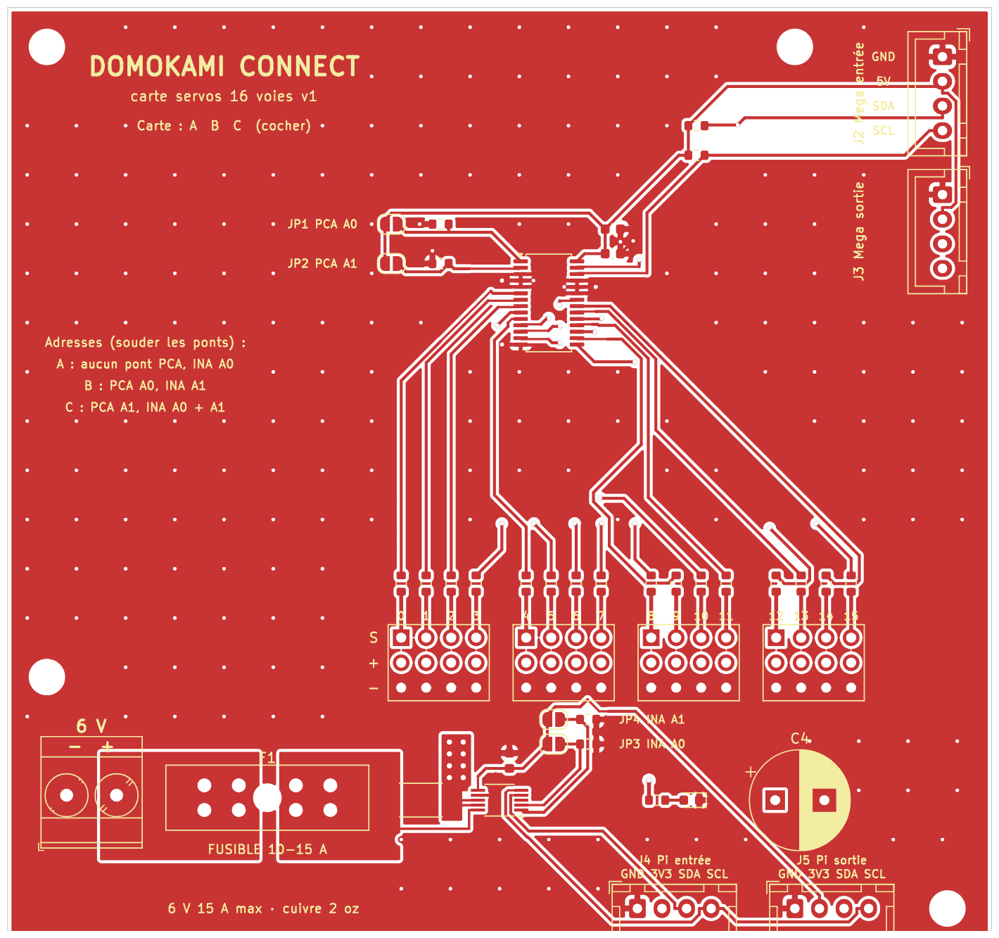

# Carte servos 16 voies (cartes A, B et C)

Une seule carte, à faire **en 3 exemplaires**. Chacune remplace, pour 16 servos :
le module PCA9685, le bornier d'alimentation, le fusible, le module INA226 de mesure de courant
et tous les fils d'alimentation volants.



| Carte | Ce qui s'y branche (voir l'onglet Câblage de l'Atelier) | Ponts à souder | Adresse PCA9685 (bus Mega) | Adresse INA226 (bus Pi) |
|---|---|---|---|---|
| **A** | tête + ventre | JP3 | 0x40 | 0x41 |
| **B** | bras + main gauche | JP1 et JP4 | 0x41 | 0x44 |
| **C** | bras + main droite | JP2, JP3 et JP4 | 0x42 | 0x45 |

Ces adresses sont exactement celles déjà réglées dans l'application (`app/wiring.py` et
`config.example.json`, partie `sensors`) : **rien à changer dans le code**. Cocher la lettre de la
carte sur la sérigraphie (« Carte : A B C ») pour ne pas les mélanger.

## Ce qu'il y a sur la carte

| Repère | Rôle |
|---|---|
| J1 | bornier à vis **6 V** (− à gauche, + à droite), 24 A |
| F1 | porte-fusible à lame ATO (fusible de voiture) : **10 A** pour la carte A, **15 A** pour B et C |
| RS1 + U2 | mesure du courant de la carte (résistance 2 mΩ + INA226), lue par le Raspberry Pi |
| C4 | réservoir 1000 µF contre les chutes de tension quand les servos démarrent |
| D1 | LED verte : le 6 V est présent après le fusible |
| J10 à J13 | 16 sorties servo, ordre **S + −** de haut en bas (signal, 6 V, masse), voies 0 à 15 |
| U1 | PCA9685, piloté par l'Arduino Mega i01.left (bus I2C de la Mega) |
| J2 / J3 | bus de la Mega : entrée / sortie (GND, 5V, SDA, SCL) pour chaîner A → B → C |
| J4 / J5 | bus du Raspberry Pi : entrée / sortie (GND, 3V3, SDA, SCL) pour chaîner A → B → C |

Le courant des servos passe par de **larges plans de cuivre** (le + sur la face du dessous, le −
sur la face du dessus), jamais par la puce. Les 16 sorties ont une résistance de 220 Ω en série
sur le signal (protection de la puce si un servo est branché à l'envers).

## 1. Commander les cartes avec les composants déjà soudés (JLCPCB)

Les puces sont très petites (pattes espacées de 0,5 et 0,65 mm) : on les fait **poser par l'usine**.
Les connecteurs, le fusible et le gros condensateur restent à souder vous-même (facile).

1. Sur https://jlcpcb.com, « Order now », envoyer **`carte_servos-gerber.zip`** (sans le décompresser).
2. Réglages : 2 couches, 1,6 mm, quantité 5, **épaisseur de cuivre « 2 oz »** (important : les plans
   de cuivre transportent jusqu'à 15 A). La carte fait 100 × 96 mm.
3. Activer **« PCB Assembly »**, face **« Top »**, quantité à assembler : 3 (ou plus).
4. Envoyer **`bom_jlcpcb.csv`** (liste) puis **`cpl_jlcpcb.csv`** (positions).
   Toutes les références LCSC sont déjà remplies : le site doit trouver les 9 lignes.
5. **Vérifier l'aperçu 3D proposé par le site** avant de payer : le point (broche 1) de U1 (PCA9685)
   et de U2 (INA226) doit tomber sur le petit triangle imprimé sur la carte. Si une puce est tournée,
   la faire pivoter dans l'aperçu (bouton « rotate ») : les conventions d'angle diffèrent parfois
   entre KiCad et JLCPCB. Les résistances et condensateurs n'ont pas de sens.
6. Vérifier le prix sur le devis : il change selon les offres, la disponibilité des pièces et le port.

## 2. Acheter les composants à souder vous-même (pour 3 cartes)

| Quantité | Composant |
|---|---|
| 3 | bornier à vis 2 points, pas de 5,08 mm (Phoenix MKDS 3/2-5,08 ou équivalent, 24 A) |
| 3 | porte-fusible ATO pour circuit imprimé (Littelfuse 178.6165, 30 A) |
| 1 + 2 | fusibles lame ATO : 1 × 10 A (carte A), 2 × 15 A (cartes B et C), + quelques rechanges |
| 3 | condensateur électrolytique 1000 µF 10 V ou plus, Ø 10 mm, pas 5 mm |
| 6 | barrettes mâles sécables 2,54 mm de 40 broches (16 × 3 broches par carte) |
| 12 | connecteur JST-XH 4 broches droit B4B-XH-A (+ câbles XH 4 fils) |

Fil d'arrivée 6 V : **AWG 14 (2,5 mm²)** au minimum. Liste détaillée : `nomenclature.csv`
(colonne « Soudé par » : JLCPCB ou vous).

## 3. Souder

1. **Les ponts d'adresse** (JP1 à JP4) selon le tableau du haut : une goutte d'étain qui relie les
   deux demi-pastilles. Un pont non soudé = 0, soudé = 1. Les ponts JP1/JP2 (PCA) sont à gauche de
   U1, les ponts JP3/JP4 (INA) à côté de U2.
2. Les barrettes servo : couper 16 morceaux de 3 broches, souder bien droit.
3. Les connecteurs JST-XH : l'encoche suit le dessin imprimé.
4. **C4 : sens obligatoire.** La patte **+** (la plus longue) dans la pastille **carrée** marquée « + ».
5. Le porte-fusible et le bornier en dernier, avec **beaucoup d'étain** (fer chaud, panne large) :
   ils portent tout le courant. Le bornier : ouvertures des vis vers l'extérieur de la carte.

## 4. Contrôler avant de brancher

- [ ] Au multimètre (continuité) : **pas de bip entre + et − du bornier J1**, ni entre 5V et GND de J2.
- [ ] Sans fusible : brancher J4 au Pi (ou au HAT capteurs). Sur le Pi, `i2cdetect -y 1` doit
      montrer l'INA226 de la carte (0x41, 0x44 ou 0x45 selon la carte).
- [ ] Brancher J2 à la Mega i01.left : un croquis « I2C scanner » (playground.arduino.cc) doit
      trouver la PCA9685 (0x40, 0x41 ou 0x42), puis remettre MRLComm sur la Mega. Une PCA9685
      répond aussi à l'adresse générale 0x70 : c'est normal.
- [ ] Mettre le fusible, alimenter en 6 V **avec une alimentation limitée en courant** si possible :
      la LED verte s'allume, aucun composant ne chauffe.
- [ ] Brancher **un seul** servo sur la voie 0 et le bouger depuis l'Atelier avant de tout brancher.

## Fichiers

| Fichier | Rôle |
|---|---|
| `carte_servos-gerber.zip` | **le fichier à envoyer au fabricant** |
| `bom_jlcpcb.csv` / `cpl_jlcpcb.csv` | liste et positions des composants posés par JLCPCB |
| `carte_servos.kicad_pcb` / `.kicad_pro` | le circuit dans KiCad (pour le regarder ou le modifier) |
| `DomokamiConnect.pretty/` + `fp-lib-table` | empreinte du bloc de 4 servos (bibliothèque locale) |
| `nomenclature.csv` | la liste complète des composants |
| `drc.txt` | rapport de vérification KiCad : 0 erreur, 0 connexion manquante |
| `fabrication/` | les fichiers Gerber et de perçage un par un |
| `build.py` | le programme qui fabrique tout cela (placement, routage Freerouting, vérification) |

## Comment la carte a été vérifiée

- Brochages relevés dans les fiches techniques et les symboles KiCad : PCA9685PW (TSSOP-28) et
  INA226 (VSSOP-10). Les adresses suivent les tableaux des fiches techniques NXP (PCA9685 :
  0x40 + A0…A5) et Texas Instruments (INA226 : A1/A0 à GND ou VS → 0x40, 0x41, 0x44, 0x45).
- Références LCSC vérifiées dans le catalogue JLCPCB / LCSC : PCA9685PW,118 C2678753,
  INA226AIDGSR C49851, résistance 2 mΩ 2 W C2904228, et les résistances, condensateurs et LED
  « basic » (C22962, C25804, C21190, C14663, C19702, C12624).
- Résistance de mesure : à 15 A elle chauffe de 0,45 W (pour 2 W admis) et donne 30 mV,
  bien dans la plage de l'INA226 (81,9 mV maximum).
- Bornier 24 A, porte-fusible 30 A : valeurs des fiches Phoenix Contact et Littelfuse.
- Le routage automatique (Freerouting 2.5) relie toutes les liaisons logiques ; les liaisons de
  puissance sont des plans de cuivre dessinés à la main. KiCad 7 (DRC) : **0 erreur et
  0 connexion manquante**.
- **Pas encore fabriquée ni essayée en vrai** : c'est la version 1.

## Régénérer

```bash
python3 build.py --freerouting freerouting-2.5.0-executable.jar --java /chemin/vers/java25
```

Prérequis : KiCad 7 et ses bibliothèques, Java 25, Freerouting 2.5. Le routage automatique ne
donne pas deux fois exactement le même dessin : seul le résultat de la vérification compte.
