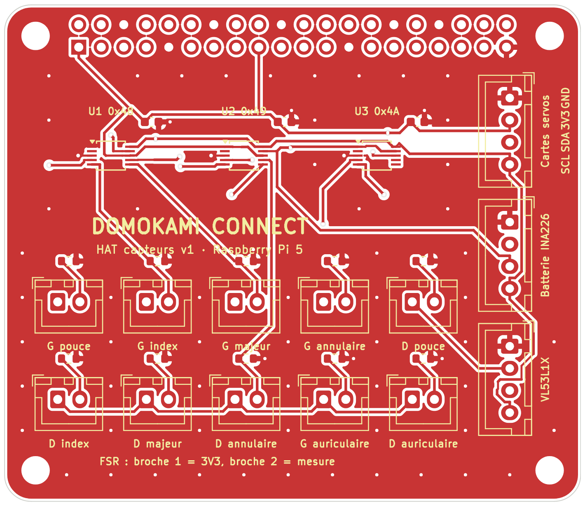

# HAT capteurs pour le Raspberry Pi 5

Une petite carte qui s'enfiche **directement sur le connecteur 40 broches du Raspberry Pi 5**.
Elle remplace les 3 modules ADS1115, les 10 résistances des capteurs du bout des doigts et toutes
les dérivations de fils du bus I2C du Pi.



| Repère | Rôle | Branché à |
|---|---|---|
| J1 (dessous) | connecteur femelle 2 × 20 | Raspberry Pi 5 : 3V3 (broches 1 et 17), SDA (3), SCL (5), GND |
| U1 | ADS1115 adresse **0x48** (ADDR à GND) | main gauche : pouce, index, majeur, annulaire |
| U2 | ADS1115 adresse **0x49** (ADDR à 3V3) | main droite : pouce, index, majeur, annulaire |
| U3 | ADS1115 adresse **0x4A** (ADDR à SDA) | auriculaire gauche (voie 0), auriculaire droit (voie 1) |
| J10 à J19 | 10 entrées FSR JST-XH 2 broches : **1 = 3V3, 2 = mesure** | un capteur FSR par doigt (marqué sur la carte) |
| R1 à R10 | 10 kΩ entre la mesure et GND | le pont diviseur des FSR est déjà fait sur la carte |
| J2 | bus I2C (GND, 3V3, SDA, SCL) | J4 « Pi entrée » de la **carte servos A** (puis A → B → C) |
| J3 | bus I2C | module INA226 de la **batterie** (0x40) |
| J4 | bus I2C | capteur de distance **VL53L1X** (0x29) |

Adresses et voies : exactement celles déjà réglées dans `config.example.json` (partie `sensors`),
**rien à changer dans le code**. Les 3 sorties J2 à J4 sont identiques : chacune peut servir pour
n'importe quel module I2C en 3,3 V.

Le FSR n'a pas de sens : ses 2 fils vont indifféremment dans les 2 broches du connecteur.

## 1. Commander la carte avec les composants déjà soudés (JLCPCB)

1. Sur https://jlcpcb.com, « Order now », envoyer **`hat_capteurs-gerber.zip`** (sans le décompresser).
2. Réglages par défaut : 2 couches, 1,6 mm, 1 oz, quantité 5. La carte fait 65 × 56 mm.
3. Activer **« PCB Assembly »**, face **« Top »**, quantité à assembler : 2 (le minimum).
4. Envoyer **`bom_jlcpcb.csv`** puis **`cpl_jlcpcb.csv`** : 3 lignes, références LCSC déjà remplies.
5. **Vérifier l'aperçu 3D** : le point (broche 1) de chaque ADS1115 doit tomber sur le petit
   triangle imprimé à côté de la puce. Sinon, faire pivoter la puce dans l'aperçu.
6. Vérifier le prix sur le devis : il change selon les offres, la disponibilité des pièces et le port.

## 2. Acheter les composants à souder vous-même

| Quantité | Composant |
|---|---|
| 1 | connecteur **femelle** 2 × 20 broches 2,54 mm (« GPIO header » pour HAT) |
| 4 | entretoises M2.5 + vis M2.5 (hauteur : celle du connecteur une fois enfiché, souvent 11 mm — mesurer) |
| 10 | connecteur JST-XH 2 broches droit B2B-XH-A (+ câbles XH 2 fils) |
| 3 | connecteur JST-XH 4 broches droit B4B-XH-A (+ câbles XH 4 fils) |

## 3. Souder

1. Les connecteurs JST-XH sur le **dessus** (le côté avec le texte), l'encoche suit le dessin imprimé.
2. **Le connecteur 2 × 20 en dernier, sur le DESSOUS** (face sans texte), soudé par le dessus.
   Astuce : l'enfoncer d'abord sur le Pi éteint, poser la carte dessus avec les entretoises,
   souder 2 broches aux coins, retirer, puis souder les 38 autres.

Raspberry Pi 5 avec le ventilateur officiel (Active Cooler) : vérifier qu'il reste de l'espace
sous la carte ; sinon utiliser un connecteur plus haut (« stacking header » ou réhausse 2 × 20).

## 4. Contrôler avant de brancher

- [ ] Au multimètre (continuité) : **pas de bip entre 3V3 et GND** (broches 2 et 1 de J2).
- [ ] Pi éteint, enficher la carte (le texte « DOMOKAMI CONNECT » sur le dessus, les 4 trous alignés
      sur ceux du Pi), allumer.
- [ ] `i2cdetect -y 1` doit afficher **48, 49 et 4a** (plus 29, 40, 41, 44, 45 quand le VL53L1X,
      l'INA226 de la batterie et les cartes servos sont branchés).
- [ ] Onglet Capteurs de l'Atelier : appuyer sur chaque FSR, la bonne barre doit monter.

## Fichiers

| Fichier | Rôle |
|---|---|
| `hat_capteurs-gerber.zip` | **le fichier à envoyer au fabricant** |
| `bom_jlcpcb.csv` / `cpl_jlcpcb.csv` | liste et positions des composants posés par JLCPCB |
| `hat_capteurs.kicad_pcb` / `.kicad_pro` | le circuit dans KiCad (pour le regarder ou le modifier) |
| `nomenclature.csv` | la liste complète des composants |
| `drc.txt` | rapport de vérification KiCad : 0 erreur, 0 connexion manquante |
| `fabrication/` | les fichiers Gerber et de perçage un par un |
| `build.py` | le programme qui fabrique tout cela (placement, routage Freerouting, vérification) |

## Comment la carte a été vérifiée

- Dimensions, coins arrondis de 3 mm, trous M2.5 (entraxe 58 × 49 mm) et position du connecteur :
  spécification mécanique officielle des HAT (github.com/raspberrypi/hats,
  `hat-board-mechanical.pdf`). Perçage 2,7 mm, dans la tolérance de la spécification (2,75 ± 0,05 mm).
- Le programme vérifie que **chacune des 40 pastilles** tombe exactement sur la bonne broche du Pi
  (broche 1 à 8,37 mm du bord gauche, rangée des broches impaires vers l'intérieur), sinon il s'arrête.
- Brochage de l'ADS1115 et adresses (ADDR à GND, VDD, SDA → 0x48, 0x49, 0x4A) : fiche technique
  Texas Instruments. Référence LCSC ADS1115IDGSR **C37593** vérifiée, ainsi que les résistances
  et condensateurs « basic » (C25804, C14663).
- Le Pi a déjà des résistances de rappel de 1,8 kΩ sur SDA et SCL : la carte n'en ajoute pas.
- Pas d'EEPROM d'identification : la carte n'en a pas besoin (broches 27 et 28 laissées libres).
- Routage automatique (Freerouting 2.5), puis KiCad 7 (DRC) : **0 erreur et 0 connexion manquante**.
- **Pas encore fabriquée ni essayée en vrai** : c'est la version 1.

## Régénérer

```bash
python3 build.py --freerouting freerouting-2.5.0-executable.jar --java /chemin/vers/java25
```

Prérequis : KiCad 7 et ses bibliothèques, Java 25, Freerouting 2.5.
