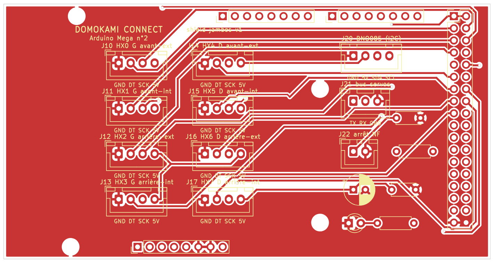

# Shield « jambes » pour l'Arduino Mega n°2

Une carte qui s'enfiche **sur l'Arduino Mega des jambes** et remplace tout le câblage volant par
des connecteurs à verrou JST-XH (impossibles à brancher à l'envers, ils ne se débranchent pas
avec les vibrations).



| Connecteur | Broches (dans l'ordre, broche 1 = carrée) | Vers la Mega | Branché à |
|---|---|---|---|
| J10 à J13 | GND · DT · SCK · 5V | DT = 22, 24, 26, 28 · SCK = 23, 25, 27, 29 | HX711 n°0 à 3 (pied gauche : avant-ext, avant-int, arrière-ext, arrière-int) |
| J14 à J17 | GND · DT · SCK · 5V | DT = 30, 32, 34, 36 · SCK = 31, 33, 35, 37 | HX711 n°4 à 7 (pied droit, même ordre) |
| J20 | GND · 5V · SDA · SCL | SDA = 20, SCL = 21 | centrale BNO085 (entrée VIN) |
| J21 | TX · RX · GND | TX1 = 18, RX1 = 19 | adaptateur de bus Waveshare : TX → TX, RX → RX (cavalier en A) |
| J22 | ARRÊT · GND | broche 2 | contact NF n°2 du bouton d'arrêt d'urgence |

Le firmware `inmoov_legs` utilise déjà exactement ces broches : **rien à changer dans le code**.
La carte ajoute une résistance de rappel de 4,7 kΩ et un filtre de 100 nF sur l'arrêt d'urgence
(plus robuste avec un long câble), le découplage du 5 V et une LED « sous tension ».

> L'ordre des 4 broches des modules HX711 varie selon les vendeurs. Le shield est marqué
> **GND DT SCK 5V** : faites correspondre chaque fil au **nom** écrit sur le module, pas à sa position.

## 1. Commander la carte (environ 10 minutes)

1. Aller sur le site d'un fabricant, par exemple https://jlcpcb.com ou https://www.pcbway.com.
2. Cliquer sur « Add gerber file » / « Quote now » et envoyer **`shield_jambes-gerber.zip`**
   (ce fichier tel quel, sans le décompresser).
3. Le site lit tout seul la taille (101,6 × 53,3 mm) et les 2 couches. Laisser les réglages par défaut :
   2 couches, épaisseur 1,6 mm, finition HASL, quantité 5 (le minimum), couleur au choix.
4. Payer et attendre la livraison (en général 1 à 2 semaines). Vérifier le prix sur le devis du site :
   il change selon les offres et les frais de port.

## 2. Acheter les composants

| Quantité | Composant |
|---|---|
| 1 | barrette mâle sécable 2,54 mm, 40 broches (pour J1, J2, J3) |
| 1 | barrette mâle double rangée 2 × 18 broches, 2,54 mm (J4) |
| 9 | connecteur JST-XH 4 broches droit B4B-XH-A (+ 9 câbles XH 4 fils) |
| 1 | connecteur JST-XH 3 broches droit B3B-XH-A (+ câble) |
| 1 | connecteur JST-XH 2 broches droit B2B-XH-A (+ câble) |
| 1 | résistance 4,7 kΩ ¼ W (R1) |
| 1 | résistance 1 kΩ ¼ W (R2) |
| 2 | condensateur céramique 100 nF (C1, C3) |
| 1 | condensateur électrolytique 100 µF 16 V, Ø 6,3 mm (C2) |
| 1 | LED 3 mm verte (D1) |

Les câbles JST-XH se vendent tout faits (« JST XH 2.54 câble 4 broches ») : c'est le plus simple.
Les connecteurs XH supportent 3 A avec du fil AWG 22, bien plus que ce qui passe ici.
Liste détaillée : `nomenclature.csv`.

## 3. Souder (fer à souder ordinaire, environ 1 heure)

Toujours des plus bas aux plus hauts :
1. R1 (4,7 kΩ) et R2 (1 kΩ), dans n'importe quel sens.
2. C1 et C3 (100 nF), dans n'importe quel sens.
3. **D1 (LED) : sens obligatoire.** La patte courte (méplat sur la LED) va dans la pastille **carrée**.
4. **C2 (100 µF) : sens obligatoire.** La patte **+** (la plus longue) va dans la pastille **carrée**
   marquée « + » ; la bande blanche du condensateur (le −) est du côté opposé.
5. Les connecteurs JST-XH : l'encoche du boîtier suit le dessin imprimé sur la carte.
6. Les barrettes vers la Mega, **en dernier** : couper les barrettes à la bonne longueur (8, 8, 8, et
   2 × 18), les **enfoncer dans la Mega**, poser le shield dessus, puis souder. Elles seront
   parfaitement alignées.

## 4. Contrôler avant de brancher

- [ ] Au multimètre (mode continuité) : **pas de bip entre 5V et GND** (par exemple entre les
      broches 4 et 1 d'un connecteur HX711).
- [ ] Coller un morceau de ruban isolant (Kapton ou chatterton) **sur la prise USB de la Mega** :
      le dessous du shield passe juste au-dessus. Le cuivre est déjà interdit à cet endroit et
      au-dessus du connecteur ICSP, par sécurité.
- [ ] Enficher le shield sur la Mega, brancher l'USB : la **LED verte s'allume**.
- [ ] Dans l'onglet Jambes de l'Atelier : connecter, « Tare », puis vérifier que les 8 cellules
      répondent (sinon : câble HX711 ou ordre GND/DT/SCK/5V).

## Fichiers

| Fichier | Rôle |
|---|---|
| `shield_jambes-gerber.zip` | **le fichier à envoyer au fabricant** |
| `shield_jambes.kicad_pcb` / `.kicad_pro` | le circuit dans KiCad (pour le regarder ou le modifier) |
| `nomenclature.csv` | la liste des composants |
| `drc.txt` | rapport de vérification KiCad : 0 erreur, 0 connexion manquante |
| `fabrication/` | les fichiers Gerber et de perçage un par un, et les plans de perçage en PDF |
| `build.py` | le programme qui fabrique tout cela (placement, routage Freerouting, vérification) |

## Comment la carte a été vérifiée

- Les positions des broches de la Mega viennent de la bibliothèque KiCad « arduino-kicad-library »
  (Alarm-Siren). Elles ont été recoupées avec l'empreinte officielle Arduino UNO R3 de KiCad
  (connecteurs communs, identiques au centième de mm) et avec les trous de fixation de la Mega.
- Chaque broche du shield a été contrôlée par le programme : elle doit tomber exactement sur une
  broche de la Mega, sinon la fabrication s'arrête.
- Le routage automatique (Freerouting 2.5) relie toutes les connexions. La vérification complète de
  KiCad 7 (DRC) donne **0 erreur et 0 connexion manquante**. Les fichiers Gerber ont aussi été
  ouverts avec un deuxième logiciel (gerbv).
- **Pas encore fabriquée ni essayée en vrai** : c'est la version 1. Commandez 5 cartes, c'est le
  minimum et cela laisse des cartes de rechange.

## Régénérer

```bash
python3 build.py --freerouting freerouting-2.5.0-executable.jar --java /chemin/vers/java25
```

Prérequis : KiCad 7 et ses bibliothèques, Java 25, Freerouting 2.5.
